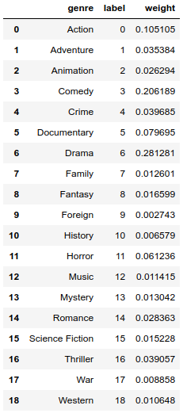
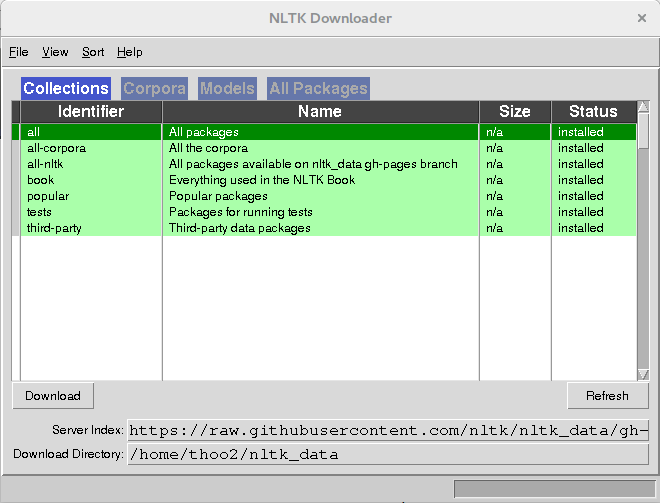
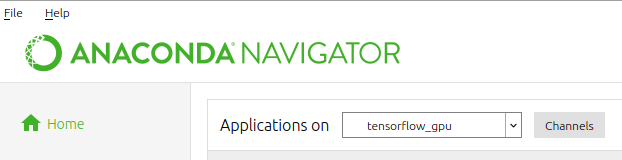
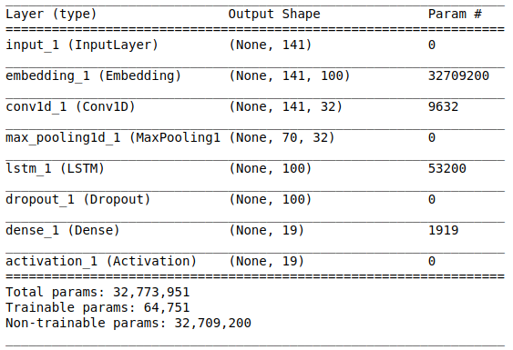

# MovieGenreClassifier

The goal of this project is to determine the genre of a movie based on its title as well as its description/overview (generally up to 140 words). The program is written in Python and enables the classification between the following types of genres:



## Installation

You will first need to clone this repository using the following command in a terminal:


```
git clone https://github.com/yjthoo/MovieGenreClassifier.git
```

The following lines will show you how to install python as well as the following required libraries:

* [TensorFlow](https://www.tensorflow.org/): TensorFlow is an open source platform for machine learning containing tools and other resources for the development of ML applications. 
* [Matplotlib](https://matplotlib.org/): This library is used to generate plots to analyse the performance of the model. 
* [pandas](https://pandas.pydata.org/): This library provides us with tools to structure and analyse our data before training our model. 
* [Keras](https://keras.io/): Keras is a neural network API that works on top of Tensorflow and enables us to quickly build and test models.  
* [scikit-learn](https://scikit-learn.org/stable/): scikit-learn is a machine learning library for Python that provide additional tools for data analysis as well as the implementation of machine learning models. 
* [NLTK](https://www.nltk.org/): The Natural Language Toolkit (NLTK) provides us with some text processing libraries which are used to treat the overview sentences in our dataset. 
* [pytest](https://docs.pytest.org/en/latest/): pytest allows the user to write tests for their program to ensure robustness. 

In this section, we will cover how to install [anaconda](https://www.anaconda.com/) as this will provide you with the [Jupyter Notebook](https://jupyter.org/) IDE (Integrated Development Environment) that was used to analyse/preprocess the data for this project.

1. In the following [link](https://www.anaconda.com/distribution/), download the open-source `Python 3.7 version` Anaconda Distribution (available for Linux, Windows, and Mac OS X). 

2. Follow the installation guide corresponding to your OS in the following [link](https://docs.anaconda.com/anaconda/install/) (**Note that the first step of the installation (downloading the installer) has already been done in the previous step**).

3. Next, we will install TensorFlow by creating a virtual envinronment as shown in the following [link](https://tensorflow-object-detection-api-tutorial.readthedocs.io/en/latest/install.html) which illustrates how to install either a CPU or GPU version of TensorFlow based on your computer. 

4. Once this is done, please make sure that your environment is still active. You can simply check this by verrifying the name displayed within brackets in your *Anaconda Prompt* window.
	For instance:
	```
	(environment_name) C:\Users\me>
	```

	where `environment_name` is the name of the environment that you created indicates that your environment is active. If this is not the case, simply type:
	```
	activate environment_name
	```

	This will ensure that all following libraries will be installed in this environment. 

5. The next step consists of installing Matplotlib, pandas, Keras and scikit-learn by typing the following lines in the command prompt:
	```
	conda install matplotlib
	conda install pandas
	conda install keras
	conda install scikit-learn
	```

	or in case of any issues, please follow the installation guides of the respective libraries:
	* [Matplotlib](https://matplotlib.org/users/installing.html)
	* [pandas](https://pandas.pydata.org/pandas-docs/stable/install.html)
	* [Keras](https://keras.io/#installation)
	* [scikit-learn](https://scikit-learn.org/stable/install.html)

6. The next stage of the installation guide consists of the installation of NLTK with the following command:
	```
	conda install nltk
	```

	In addition to this, you will also need to do the following as this project makes use of NLTK's stopwords:

	1. In the command prompt, type:
		```
		python
		```

	This will allow you to directly run Python commands in the terminal.

	2. Type the following commands:
		```
		import nltk
		nltk.download()
		```

	This will open a new window and enable you to download the collections by clicking on download. You should obtain something similar to the following image:

	

	3. Once this is done, you can simple type:
		```
		quit()
		```

	which will stop the Python interpreter. 

7. Finally, we install pytest through the following command:

	```
	conda install -c anaconda pytest 
	```


## Datasets

In addition to the libraries listed above, you will need to download the following datasets:

* The `movies_metadata.csv` file from the [movies dataset on kaggle](https://www.kaggle.com/rounakbanik/the-movies-dataset#movies_metadata.csv) and put it in the `datasets` folder
* [GloVe (Global Vectors for Word Representation) dataset](https://nlp.stanford.edu/projects/glove/): glove.6B.zip and extract its contents inside of the `datasets` folder


## Running the program

1. Open an *Anaconda Prompt* window and activate your virtual environment.
2. Next, navigate to the directory where the `MovieGenreClassifier.py` script is.
3. To run the script, you simply have to run the following line:
	```
	python MovieGenreClassifier.py --title <title> --description <description>
	``` 

	where `<title>` is the name of the movie and `<description>` is the overview of the corresponding movie. You can obtain an overview of a movie from sites such as [IMDb](https://www.imdb.com/?ref_=nv_home), etc.

	**Usage example:**
	```
	python MovieGenreClassifier.py --title "Othello" --description "The evil Iago pretends to be friend of Othello in order to manipulate him to serve his own end in the film version of this Shakespeare classic."
	```

	**Output format:**
	```
	{
    	"title": "Othello",
    	"description": "The evil Iago pretends to be friend of Othello in order to manipulate him to serve his own end in the film version of this Shakespeare classic.",
    	"genre": <predicted genre>
	}
	```

	where `<predicted genre>` is the genre predicted by the model.

	**Notes:** 
	1. Due to the fact that this program uses TensorFlow and not TensorFlow 2.0, you will most probably receive multiple deprecation warnings in the terminal. For better readability, the program uses a 	clear function to erase these before outputing its prediction. Additionally, it will also output the confidence of its prediction. You can stop these from happening by setting 
	```
	clearConsole = False, outputConfidence = False
	```
	in the last line of code of the `MovieGenreClassifier.py` script.
	
	2. Due to prevalence of `Drama` genre movies, you may have the impression that the model only outputs this genre. However, a typical example to output another genre is the following:

	```
	{
		"title": "Mamma Mia!", 
		"description": "The story of a bride-to-be trying to find her real father told using hit songs by the popular 1970s group ABBA.", 
		"genre": "Comedy"
	}
	```

## Modifying the program, running tests and training the model

### Changing the preprocessing of the dataset

To modify the preprocessing of the dataset, you can either directly modify the `preprocessing.py` script or open the notebook with the same name. To better visualise what is happening during the preprocessing, I would recommend modifying and testing your changes in the notebook.  

To open the notebooks used to preprocess the data and test each stage of the program, you will need to ensure that your virtual environment is active when opening Jupyter Notebook. To do this, open Anaconda Navigator and swtich to the correct environment at the top of the window:



Once you are happy with your changes within your notebook, you can incorporate your functions inside of the `preprocessing.py` script, navigate to the directory where this script is located and run it through the following command in the terminal:

```
python preprocessing.py
```

This will regenerate the `genreLabels.csv` and `preprocessed.csv` files used to train the model and generate predictions. 

### Changing dataset

If you wish to change the dataset, i.e. use a different one than the `movies_metadata.csv` file discussed above, you will have to change the `input_file` variable in the main of the `preprocessing.py` script:

**Example:** changing from the `movies_metadata.csv` dataset to a dataset called `example.csv` located in the `datasets` folder
	
	*Initial:* 
		```
		input_file = 'datasets/movies_metadata.csv'
		```

	*Final:*
		```
		input_file = 'datasets/example.csv'
		```

**Note:** Don't forget to run the preprocessing script after changing dataset by running the following command in the terminal
	```
	python preprocessing.py
	```

### Runing tests to ensure robustness

To run tests, you can simply run the following command within the directory where the `MovieGenreClassifier.py` script is located:

```
pytest
``` 

This will search for all scripts starting with `test_` and run all functions within it starting by the same string.

### Training the model

The summary of the current model used by the program is the following:



To train this model (used by the `MovieGenreClassifier.py` script: see `GenreClassifierV2` in the `trainModel.py` script), you can run the following command from the command prompt:

```
python trainModel.py
```

after deciding the number of epochs you desire, the dropout rate etc by modifying the inputs given to the `trainModelV2` funtion within the main:

```
trainModelV2(X_indices, Y_oh, word_to_vec_map, word_to_index, max_length = max_sequence_length, summary = False, 
               dropout_rate = 0.2, batch_size = 32, epochs = 50, loss ='categorical_crossentropy', 
               optimizer ='adam')
```

as well as changing the name of the model inside of the `ModelCheckpoint` function within `trainModelV2`.


### Designing and training a new model

The `GenreClassifierV2` model currently used by this project is not optimal such that you may want to design your own model or find one online such as the approach taken in the [following link](https://www.analyticsvidhya.com/blog/2019/04/predicting-movie-genres-nlp-multi-label-classification/). Once this is done, you can replace the `GenreClassifierV2` function inside the `trainModelV2` function within the `trainModel.py` script with the name of your function inside of which your model is constructed. 

You can then train your model by running the following command from the command prompt:

```
python trainModel.py
```

**Note:** You may want to change the name of the saved models by changing the first parameter of the `ModelCheckpoint` function within `trainModelV2`. Furthermore, you will also need to change the name of the model loaded in the `MovieGenreClassifier.py` script used to generate a prediction.